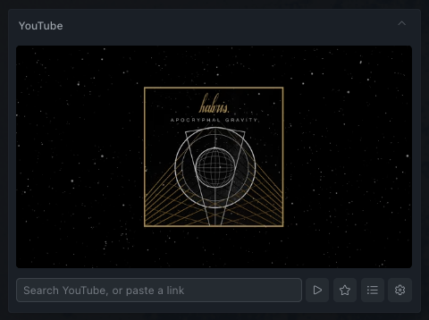
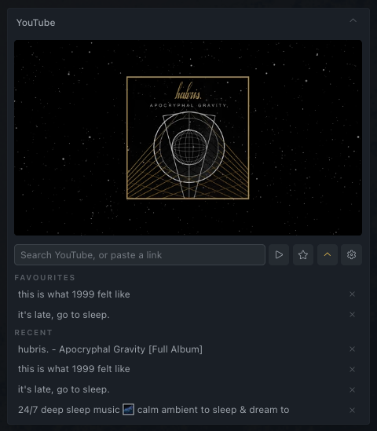

<h1 align="center">hermes-yt-plugin</h1>

<p align="center">
  A compact, floating YouTube player for the Hermes Desktop client.
</p>

<p align="center">
  
  
  
  
</p>

Search YouTube or paste a link, keep playback running while you work, and save
favourites for later. The plugin uses YouTube's normal watch page in an isolated
Electron `<webview>`, so it requires no API key and does not access media streams
directly.

## Screenshots

<table>
  <tr>
    <td width="50%"></td>
    <td width="50%"></td>
  </tr>
  <tr>
    <td align="center"><strong>Compact player</strong></td>
    <td align="center"><strong>Expandable library</strong></td>
  </tr>
</table>

## Features

- Search YouTube without configuring an API key.
- Play watch, playlist, Shorts, Live, embed, and `youtu.be` links.
- Keep playback mounted while searching or browsing the library.
- Save favourites and retain up to 12 recent videos.
- Hide recent history without deleting it.
- Resize, reposition, expand, and collapse with smooth pane transitions.
- Run in a webview session isolated from other Hermes webviews.
- Check for and install published plugin updates without leaving Hermes.
- Open, hide, browse favourites, or clear playback from the command palette.

## Install

Clone the repository and run the installer:

```bash
git clone git@github.com:chillerno1/hermes-yt-plugin.git
cd hermes-yt-plugin
./install.sh
```

The default destination is `~/.hermes/desktop-plugins/hermes-yt-plugin`. Set
`HERMES_HOME` before running the installer to target another Hermes profile:

```bash
HERMES_HOME=/path/to/profile ./install.sh
```

This is a UI-only runtime plugin. It has no backend, build step, or
`plugin.yaml`. Hermes watches the desktop plugin directory and reloads installed
changes automatically.

## Updates

Open the settings cog and select **Check for updates**. The plugin checks the
latest published GitHub Release and, when a newer version exists, can replace
its installed `plugin.js` directly. The downloaded file must come from the
exact release tag and declare the expected plugin ID and version before Hermes
will write it.

Hermes hot-reloads the updated file. Favourites, recent history, pane geometry,
and the isolated YouTube session remain under the same storage keys. Builds
without the required desktop filesystem bridge open the release page for a
manual update instead.

## Troubleshooting

### Installed, but Settings → Plugins shows "0 installed"

If Settings → Plugins reports `No desktop plugins installed yet` and clicking
**Open plugins folder** raises:

```text
Could not open the plugins folder
ENOENT: no such file or directory, mkdir 'undefined'
```

then the plugin is installed correctly and Hermes cannot see it. This is a
Hermes Desktop bug, not a fault in this plugin — nothing on disk can load while
it applies.

**Cause.** Affected builds ask the *connected backend* where `HERMES_HOME` is.
Point the desktop client at a remote gateway and the backend answers with a path
on the remote machine — or with nothing — so the client resolves its plugin root
to the literal string `undefined` and never looks in your local profile. Upstream
issue [NousResearch/hermes-agent#66899][66899]. From `apps/desktop/electron/main.ts`
on `main`:

> A remote backend reports its own `hermes_home` over the gateway, which is a
> path on the REMOTE box; deriving the plugin dir from it yields
> `undefined/desktop-plugins` (or a non-existent remote path) and the on-disk
> plugin door silently breaks (#66899).

**Who is affected.** Only sessions connected to a remote backend — check for a
`Remote: <host>:<port>` indicator in the status bar. Purely local sessions
resolve the path correctly and are unaffected.

**Affected versions.** Every release up to and including `v2026.7.20`
(2026-07-20, Hermes Desktop `0.17.0`). Verified by inspecting
`apps/desktop/electron/main.ts` at each tag: no release yet contains the
`hermes:fs:desktopPluginsRoot` handler that fixes it.

**Fixed in.** Unreleased as of 2026-07-30. The fix is on `hermes-agent` `main`,
landing after `v2026.7.20`; it moves the resolution into the Electron main
process so the plugin root always comes from the *local* `HERMES_HOME`,
whatever the connection mode.

**Workarounds.**

1. Run Hermes locally instead of against a remote backend.
2. Update Hermes Desktop to a build that includes the fix.
3. Install into the remote machine's profile instead —
   `HERMES_HOME=/path/on/remote ./install.sh`, run there.

[66899]: https://github.com/NousResearch/hermes-agent/issues/66899

## Controls

| Control | Action |
| --- | --- |
| Search field | Search YouTube or paste a supported link |
| Enter / play button | Play a pasted link or the top search result |
| Star | Add or remove the current video from favourites |
| List / chevron | Show or hide favourites and recent history |
| Settings cog | Configure recent history and check for plugin updates |
| Floating pane | Drag the header or resize from the southeast corner |
| Status bar chip | Hide or restore the player |
| Command palette | Show, hide, open favourites, or clear the player |

The library expands the floating pane to fit its content up to the available
viewport height. Longer lists remain scrollable without displaying a visual
scrollbar.

## Supported Links

Accepted targets include YouTube watch pages, `youtu.be`, playlists, Shorts,
Live, and embed URLs, plus bare 11-character video IDs. Start timestamps in
`t=` or `start=` are honoured, including values such as `1h2m3s`.

The current URL, favourites, recent-visibility setting, and recent history are
stored in Hermes plugin storage. The `persist:hermes-yt-plugin` partition gives
the player its own cookie jar, isolated from other Hermes webviews and persisted
across restarts.

## Known Limitations

**There is no sign-in flow.** The player is always signed out, so you get the
logged-out YouTube experience: ads, no subscriptions feed, no watch history, no
playlists. The partition would persist a session, but nothing can establish one
— the masthead (and its sign-in button) is hidden by the pane's CSS, the webview
is created without `allowpopups`, and `accounts.google.com` rejects Electron's
user agent as an insecure embedded browser regardless.

Signing in would not remove ads on a free account — only YouTube Premium does
that. This plugin plays YouTube's own player untouched and does not block ads or
access media streams.

## Playback Lifecycle

Searching and opening the library leave the player mounted, so playback
continues through those interactions. Hiding or collapsing the floating pane
unmounts its body and stops playback. This is a constraint of how Hermes renders
floating panes.

## How It Works

The packaged Hermes renderer runs over `file://`, which does not provide a
suitable referrer for YouTube iframe verification and can cause Error 153. This
plugin loads a normal YouTube watch page as a top-level HTTPS document inside a
webview instead.

Search also runs inside a hidden webview on the YouTube origin. It fetches the
results page same-origin and extracts video entries from `ytInitialData`. Search
failures are isolated from playback and return an empty result list.

## Development

```text
desktop-plugins/hermes-yt-plugin/plugin.js # Complete runtime plugin
docs/screenshots/                         # README media
install.sh                                # Hermes profile installer
```

The runtime plugin is uncompiled ESM and uses `react/jsx-runtime` rather than
JSX. Imports are deliberately limited to `@hermes/plugin-sdk`, `react`, and
`react/jsx-runtime`; Hermes validates this list using a raw-source import scan.
Styles remain inline because Tailwind does not scan runtime plugin directories.

The plugin ID, install directory, command namespace, and webview partition all
use `hermes-yt-plugin`. This release intentionally starts with fresh pane
geometry, plugin storage, history, favourites, and YouTube session state.

Basic local validation:

```bash
node --check desktop-plugins/hermes-yt-plugin/plugin.js
bash -n install.sh
```

## Possible Future Work

Nothing here is promised or in progress.

- **Sign-in.** Would need the masthead unhidden, a stock browser user agent on
  the webview, and the auth popup allowed through. Google actively blocks
  sign-in from embedded webviews, so this may simply not be workable — and it
  would not remove ads on a free account either. See
  [Known Limitations](#known-limitations).

## License

[MIT](LICENSE)
